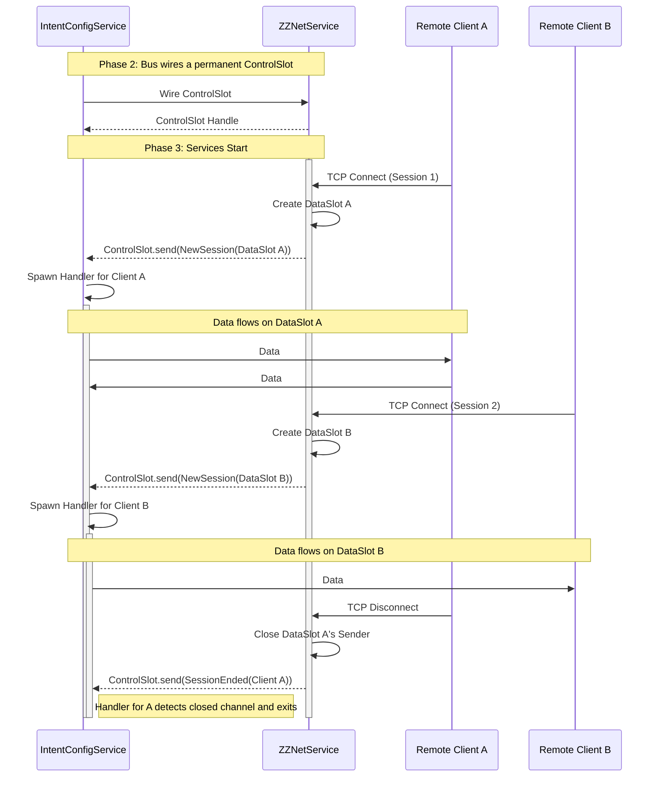
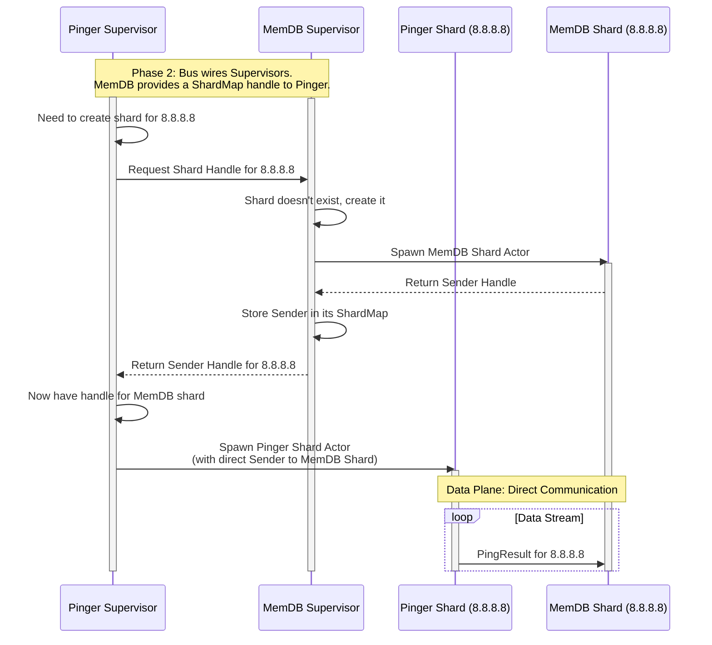

### **Document Title: ZZPing Service Framework: Architectural Design & Rationale**

**Version:** 0.1 (Draft)
**Authors:** David Martínez Martí, Gemini 2.5 Pro AI Studio (AI Design Partner)

---

### **Chapter 1: Introduction & Guiding Principles**

#### **1.1. Purpose**

This document defines the official architectural vision for the ZZPing project's component model. Its goal is to establish a robust, reusable framework for building and composing autonomous, asynchronous services. This design supersedes the initial ad-hoc component implementations found in the `zznet` and `intent-config` prototypes and will serve as the blueprint for all future component development. This document describes the **target architecture**, noting that the current codebase is a prototype from which these architectural lessons were learned and is slated for refactoring to meet this new design.

#### **1.2. The Problem Statement: The "Snowflake" Architecture**

The initial prototypes for the `zznet` networking layer and the `intent-config` component, while functional and well-tested, exhibited a core architectural weakness. The components were difficult to reason about, their lifecycles were ambiguous, and their usage patterns were governed by a set of unwritten, implicit rules.

Each component's implementation felt like a "snowflake"—a unique, fragile solution that worked in isolation but lacked a cohesive, underlying philosophy. This made the system hard to maintain and scale, as a developer needed expert knowledge of each component's internal details to use it correctly. The goal of this new architecture is to replace this collection of snowflakes with a uniform, predictable, and resilient framework.

#### **1.3. Guiding Principles & Core Requirements (The Constraints)**

The following principles, established through rigorous design discussion, form the non-negotiable foundation of this architecture. They are the constraints that guide all subsequent design decisions.

*   **Compiler-Enforced Safety over Runtime Logic:** The framework must be designed to make incorrect usage a compile-time error wherever possible. We must favor static guarantees from the Rust type system over runtime checks that can be forgotten or implemented incorrectly.
*   **Explicit Lifecycles:** Services must have clear, manageable lifecycles. Their creation, activation, and graceful shutdown must be explicit and owned by the application's composition root. "Fire-and-forget" background tasks that become zombies are explicitly forbidden.
*   **The Principle of a "Session":** For inter-process communication, the network connection *is* the session. The framework must assume that a transport-level failure (e.g., a TCP disconnect) implies that the remote peer's state has been reset (e.g., due to a process restart). This failure is a critical lifecycle event that *must* be propagated to the relevant local services, not hidden by a transparent resiliency layer. This principle stands in direct opposition to models that attempt to transparently hide network failures through automatic reconnection and buffering. We explicitly reject that approach because in our domain, a disconnect is a strong signal of a peer state reset, and hiding this critical information would lead to state desynchronization and data corruption.
*   **Separation of Concerns:** Services must be autonomous, encapsulated actors. All communication must occur through well-defined, strongly-typed interfaces ("slots"). A service's internal state must remain private.

### **Chapter 2: Autopsy of the "Snowflake": Analysis of the Initial Prototype**

This chapter dissects the specific problems in the initial codebase that led to the "hard to reason about" feeling. These are the anti-patterns we are explicitly designing the new framework to eliminate.

#### **2.1. The Implicit Protocol Problem**

The prototype's API was shaped like a collection of independent tools, but it was actually a machine that had to be assembled in a specific, un-enforced order. The function signatures did not guide the user to the correct usage pattern.

*   **Example:** The `ZzNet::listen_for_channel` method could be called on a `ZzNet` instance that was configured as a client. The code would compile without error, but the returned channel would never receive any messages, leading to silent, difficult-to-debug failures at runtime.

#### **2.2. The Divorced Lifecycle Problem**

The lifecycle of a service's core logic was completely disconnected from the lifecycle of its public-facing handle object.

*   **Example:** The `ZzNet::new()` and `IntentConfig::new_server()` functions would immediately call `tokio::spawn`, launching an actor task into the background. The function would then return a lightweight handle. If the user dropped this handle, the actor task would continue running, becoming a "zombie" process, leaking resources and state. There was no mechanism for graceful shutdown.

#### **2.3. The Spooky Action at a Distance Problem**

The prototype broke the purity of the actor model by re-introducing shared mutable state for communication, creating a non-obvious and fragile data flow.

*   **Example:** The `zznet-lib` facade used an `Arc<Mutex<Option<Connection>>>`. A background networking task would occasionally write a `Connection` object into this global variable. A foreground task would then try to read from it. This is a classic race condition and a form of "spooky action at a distance" that is extremely difficult to reason about and test reliably.

#### **2.4. The Ambiguous Identity Problem**

The system lacked a mechanism for establishing a stable, logical identity for remote peers, making stateful orchestration across reconnections impossible.

*   **Example:** The server assigned a simple, incrementing `u64` as the `ClientId` for each new TCP connection. If a single logical collector disconnected and reconnected, it would receive a new `ClientId`. The server-side orchestrator (`CState`) had no way of knowing that this new connection belonged to the same logical entity, making it impossible to safely manage a zero-downtime handoff.

### **Chapter 3: The Architectural Vision: A Framework for Composable Services**

To solve these foundational issues, we are moving from writing isolated components to building a cohesive **framework for composing asynchronous services.**

#### **3.1. The Foundation: Layered Networking Architecture**

This service framework is built upon a foundational networking library (`zznet`) which is itself composed of three carefully layered crates:
*   **`zznet-api`:** An abstract API layer defining traits like `ZzChannel` that represent networking capabilities without implementation details.
*   **`zznet`:** A concrete implementation of the networking engine that fulfills the API contracts.
*   **`zznet-lib`:** A factory layer that provides convenient construction and configuration of networking components.

This three-layer architecture ensures that services, by depending only on the `zznet-api` traits, are completely decoupled from networking implementation details. This decoupling is a major enabler of the service framework's flexibility and testability—services can be tested with mock networking implementations, and the networking layer can be evolved independently without breaking dependent services.

#### **3.2. The Paradigm Shift**

A "Service" is a long-running, autonomous sub-program (an actor) with a clearly defined set of responsibilities. The framework's job is to make it easy to instantiate, configure, connect, and manage the lifecycle of these services.

#### **3.3. The Three-Phase Service Lifecycle (The Core Pattern)**

This is the heart of the new architecture. Every service in the system will follow this explicit, three-phase lifecycle, enforced by the type system.

1.  **Phase 1: Instantiation (The Builder):** Services are first created as inert `...ServiceBuilder` objects. These builders hold configuration data but contain no active logic.
    ```rust
    // Creates a data-only builder, does not spawn any tasks.
    let memdb_builder = MemDBService::new(memdb_config);
    let pinger_builder = PingerService::new(pinger_config);
    ```

2.  **Phase 2: Wiring (Dependency Injection):** The builders are connected to each other. This is where the communication channels (`mpsc`, `watch`, etc.) are created and shared between the services *before* any of them start running.
    ```rust
    // Connect the builders. This establishes the communication topology.
    pinger_builder.connect_to_memdb(&memdb_builder);
    ```

3.  **Phase 3: Activation (The Handle):** The `.start()` method is called on a fully-wired builder. This method consumes the builder, spawns the service's actor task, and returns a `Running...Handle`. This handle is the service's public API and the tool for managing its lifecycle.
    ```rust
    // Consumes the builders and returns live handles.
    let memdb_handle = memdb_builder.start();
    let pinger_handle = pinger_builder.start();
    ```

##### Diagram: Three-Phase Service Lifecycle

```mermaid
graph TD
    subgraph "Phase 1: Instantiation (Inert Builders)"
        A[main: let pinger_builder = PingerService::new(...)]
        B[main: let memdb_builder = MemDBService::new(...)]
    end

    subgraph "Phase 2: Wiring (Dependency Injection)"
        C(main: pinger_builder.connect_memdb(&memdb_builder))
    end

    subgraph "Phase 3: Activation (Spawning Actors)"
        D[main: let pinger_handle = pinger_builder.start()]
        E[main: let memdb_handle = memdb_builder.start()]
    end

    subgraph "Running System (Handles & Actors)"
        F[pinger_handle]
        G[memdb_handle]
        H((Pinger Actor Task))
        I((MemDB Actor Task))
    end

    A --> C
    B --> C
    C --> D
    C --> E
    D -- owns/manages --> H
    E -- owns/manages --> I
    F -- commands --> H
    H -- data --> I
    G -- commands --> I

    linkStyle 7 stroke:#0f0,stroke-width:2px,stroke-dasharray: 5 5;
    style H fill:#f9f,stroke:#333,stroke-width:2px
    style I fill:#f9f,stroke:#333,stroke-width:2px
```

**Explanation:**
- The flow starts in `main` (the Composer).
- **Phase 1:** Inert `Builder` objects are created.
- **Phase 2:** The `connect_memdb` call wires them together. This is where the communication channel would be created and shared.
- **Phase 3:** The `.start()` methods are called, which consume the builders.
- **Running System:** This results in `Handle` objects that the `main` function owns. These handles are used to command the background Actor Tasks, which are now running independently. The green dashed line shows the data flow over the channel that was established during the wiring phase.

#### **3.3.1. Eliminating a Class of Race Conditions by Design**

The three-phase lifecycle pattern is not merely a convenience; it is a critical reliability feature that eliminates an entire class of race conditions that plague distributed systems. This pattern solves the notorious "late subscriber" or "cold start" race condition that has caused countless hours of debugging in production systems.

**The Problem:** In traditional pub/sub architectures, publishers may start sending messages before all subscribers are ready, leading to lost initial messages or inconsistent state. This is particularly insidious in systems where the first message carries essential initialization data—a service might appear to be running correctly but be operating with incomplete or stale state due to missed startup messages.

**The Solution:** The `wire-then-start` model makes this race condition impossible by design. During the wiring phase, all communication channels are established and subscribers are guaranteed to be listening *before* any publisher can send its initial message in the activation phase. This compile-time enforcement ensures that all services begin with a consistent, synchronized state.

**The Significance:** This pattern moves the responsibility for correct initialization from the developer's runtime logic to the compiler's static checks, which represents a massive leap in system robustness. Rather than relying on careful coordination code that can be forgotten or implemented incorrectly, the framework makes incorrect startup ordering a compile-time impossibility. Entire frameworks have been built around solving this single problem; we eliminate it at the architectural level.

#### **3.4. The `ServiceCommsBus` Concept**

As a potential quality-of-life improvement, the manual `connect_to_*` wiring could be centralized into a `ServiceCommsBus`. Services would register themselves with the bus, and the bus would handle the wiring automatically based on the types of communication slots they expose. This is a future refinement to consider for scalability.

### **Chapter 4: Core Framework Design: Agreed-Upon Solutions**

This chapter details the specific, agreed-upon solutions to the most critical architectural challenges.

#### **4.1. The `zznet` Boundary Service & "Session Provisioning"**

**Design Rationale:** The core challenge at the heart of any networked system is bridging two fundamentally different worlds: the static, reliable local service environment and the dynamic, unreliable remote network environment. Traditional approaches often try to hide this impedance mismatch, but our architecture makes it explicit and manageable.

*   **The Problem:** How to bridge the static, reliable local service world with the dynamic, unreliable remote network world, while respecting the "Transport Failure == Session Failure" principle.
*   **The Solution: The "Queue of Queues" Model.** The `zznet` service will act as a **Session Provisioner**.
    *   The connection between a local service (e.g., `IntentConfigService`) and `ZZNetService` is a permanent, statically-wired **`ControlSlot`**.
    *   The messages sent over this `ControlSlot` are lifecycle events, primarily `NewSession(SessionHandle)`.
    *   The `SessionHandle` contains a dedicated, ephemeral **`DataSlot`** (a channel pair for `Vec<u8>`). This `DataSlot` represents the data plane for a single, unique remote session.
*   **How This Solves Connection Awareness:** The lifecycle of the `DataSlot` is tied 1:1 to the lifecycle of the underlying `zznet` connection. When a disconnect occurs, `zznet` closes its end of the `DataSlot`. Any local service task using that slot will immediately receive `None` on its next read, providing a clean, unambiguous, and compiler-enforced signal that the session is dead and its state must be re-evaluated.

##### Diagram: Session Provisioning Model



**Explanation:**
- The `ControlSlot` is the permanent communication line established at startup.
- When `Client A` connects, `ZZNetService` creates a new set of channels (`DataSlot A`) and sends the handle for it down the `ControlSlot`.
- `IntentConfigService` receives this and spawns an internal handler for that specific session.
- The same process repeats for `Client B`.
- When `Client A` disconnects, `ZZNetService` closes its side of `DataSlot A`. The dedicated handler in `IntentConfigService` sees the channel close and terminates, cleaning up that session's resources without affecting the handler for `Client B`.

#### **4.2. Rejected Alternative: The "Transparent Resilient Channel"**

**Design Rationale:** During the architectural design phase, we carefully considered whether the `zznet` service should attempt to hide network disconnects from local services by automatically reconnecting and buffering messages. This approach is common in many distributed systems and initially appeared attractive as a way to simplify client code.

**The Core Domain Insight:** We explicitly rejected this model based on a fundamental insight about our specific operating environment: **In this system, 99.9% of TCP disconnects are not random network flaps; they are the result of a process restart, and therefore a state reset. Optimizing for the 0.1% case at the expense of creating ambiguity in the 99.9% case is an unacceptable architectural trade-off.**

**Reason for Rejection:** This model violates the core guiding principle that **Transport Failure == Session Failure**. Hiding the disconnect prevents stateful services from knowing that the remote peer has likely restarted and its in-memory state has been lost, which would lead to state desynchronization and data corruption.

In our domain, when a collector process restarts, it loses all its accumulated ping statistics, timing windows, and other ephemeral state. If the database service continued to operate under the assumption that the collector's state was intact (because the disconnect was hidden by a transparent resiliency layer), it would make orchestration decisions based on false information, potentially leading to data loss or corruption.

**The Alternative:** The chosen "Session Provisioning" model is more complex to implement, but it is architecturally correct for our specific use case. It ensures that session state boundaries are explicit and that state resets are immediately visible to all dependent services.

#### **4.3. Service Identity**

*   **The Problem:** The need for a stable, logical identity for remote peers to enable stateful orchestration (like handoffs) across multiple connections.
*   **The Solution:** A client's identity will be a tuple: `(StableId, ConnectionNonce)`.
    *   The **`StableId`** is a `String` representing the persistent, logical entity. It will be cryptographically derived from the Subject Common Name (CN) of the client's mTLS certificate (e.g., `"collector-de-lon-01"`).
    *   The **`ConnectionNonce`** is an ephemeral `u64` for a single TCP connection. It will be a random number generated by the client and sent in its initial `Hello` message.
    This provides the orchestrator with the necessary context to distinguish between different processes of the same logical service.

#### **4.4. Solving the 'Hung Process' Handoff Failure via Duality of Authority**

**The Problem:** Zero-downtime handoffs in distributed systems face a particularly nasty failure mode that is often overlooked: the hung or zombie process. Standard orchestration assumes that a non-responsive process is a dead process. This assumption is dangerously false in real-world operating conditions where a process can hang (due to CPU starvation, memory pressure, or deadlocks) without cleanly exiting. This leads to a critical race condition.

Consider this scenario:
*   A collector process (C1) hangs without cleanly exiting. The operating system, seeing the process is still alive, does not release its exclusive `TCPlock`.
*   The remote Database service, observing missed heartbeats, correctly assumes C1 is faulty and commands a new collector (C2) to become `Primary`.
*   C2 attempts to acquire the local `TCPlock` as part of its promotion, but fails because the zombie C1 process still holds it.
*   The system is now in a **split-brain state**: the Database *thinks* C2 is primary, but C2 *knows* it isn't and cannot perform its duties.

This creates a dangerous inconsistency where orchestration decisions are made based on false assumptions about which process is actually active, leading to a silent and prolonged data outage.

**The Solution: Duality of Authority with Explicit Confirmation.** To solve this, the framework mandates that a handoff requires agreement from two independent authorities before a state transition is considered complete:
    1.  The **Database Scheduler** (the remote, *strategic* authority) decides *when* and *which* collector should become primary based on its view of the global system state.
    2.  The **`TCPlock`** (the local, *tactical* authority) on the collector host enforces that only one process can physically hold the primary role at a time, preventing local split-brain scenarios.

**The Mechanism:** A collector cannot become `Primary` solely because the database scheduler commanded it; it must *also* successfully acquire the local `TCPlock`. The protocol is as follows:
1. The Database sends a `PromoteToPrimary` command.
2. The receiving collector attempts to acquire the `TCPlock`.
3. If it fails, the collector enters a new, explicit state: **`AwaitingLock`**.
4. In this state, the collector continues to heartbeat, but reports its `current_role` as `AwaitingLock`.

This explicit state turns the ambiguous failure into a piece of observable system telemetry. The Database scheduler can now distinguish between a healthy `Primary` and a `Primary`-elect that is blocked. This allows the system's control plane (and any human operators) to understand the exact nature of the problem—that a handoff is contested by a zombie process—and take precise corrective action, such as forcefully terminating the hung process. This protocol of explicit confirmation ensures that both authorities are synchronized, eliminating the race condition while maintaining resilience against partial failures.

### **Chapter 5: Open Design Questions & Candidate Patterns (Work In Progress)**

This chapter explores the next layer of design challenges. The core framework is considered solid; the following are candidate patterns for implementing more complex interactions on top of it. **The proposals herein are not yet finalized and require further discussion and prototyping.**

#### **5.1. The "View into the Service" API (Hole #4)**

*   **The Problem:** How to safely and performantly query state from a running service actor, especially from a synchronous context like a GUI, without breaking encapsulation or causing UI freezes.
*   **Rejected Approach: `Arc<RwLock<T>>`:** This was rejected due to the high risk of UI freezes caused by lock contention, its violation of the actor's exclusive state ownership, and the general undesirability of runtime-managed shared ownership (`Arc`).
*   **Candidate Pattern: The Push-based "View Model":** The proposed solution involves a shift from a pull to a push model.
    1.  The GUI service sends a command to the `MemDBService` handle to subscribe to a view, specifying the desired data range and resolution (`ViewSpec`).
    2.  The `MemDBService` actor spawns an internal task that periodically re-runs this query against its private data, producing a `ViewModel`.
    3.  This `ViewModel` is published on a `tokio::sync::watch` channel.
    4.  The GUI holds the `watch::Receiver`. In its synchronous `update` loop, it performs a cheap, non-blocking check for a new `ViewModel` and redraws if one is available.

##### Diagram: Push-based View Model Pattern

```mermaid
sequenceDiagram
    participant GUI as GUI
    participant MDB as MemDBService Handle
    participant Actor as MemDB Actor
    participant Task as View Task

    Note over GUI,MDB: GUI initiates subscription

    GUI ->> MDB: handle.subscribe_view(ViewSpec)
    MDB ->> MDB: Create watch channel (watch_tx, watch_rx)
    MDB ->> Actor: Command::SubscribeView(ViewSpec, watch_tx)
    MDB -->> GUI: return watch_rx

    Note over Actor: Actor receives command and spawns task
    activate Actor
    Actor ->> Actor: Clone Arc<Data> (read-only)
    Actor ->> Task: Spawn View Task(ViewSpec, Arc<Data>, watch_tx)
    activate Task

    loop Periodic View Updates
        Note over Task: Task reads data directly via Arc<Data>
        Task ->> Task: Query/Filter data via Arc<Data>
        Task ->> Task: Generate ViewModel
        Task ->> Actor: watch_tx.send(ViewModel)
    end

    loop UI Update Loop
        Note over GUI: Non-blocking check for new data
        GUI ->> GUI: if watch_rx.has_changed() then borrow latest ViewModel
        GUI ->> GUI: Redraw UI
    end

    deactivate Task
    deactivate Actor
```

**Explanation:**
- The GUI calls `handle.subscribe_view(ViewSpec)` to request a view of the data.
- The handle creates a `watch` channel pair (`watch_tx`, `watch_rx`) synchronously and returns the `watch_rx` to the GUI immediately.
- The handle sends a command to the actor with the `ViewSpec` and `watch_tx`.
- The actor receives the command, clones its internal data as a read-only `Arc<Data>`, and spawns a dedicated `View Task` with the `ViewSpec`, `Arc<Data>`, and `watch_tx`.
- The `View Task` periodically queries the data via the `Arc<Data>`, generates a `ViewModel`, and pushes it to the `watch_tx`.
- The GUI performs cheap, non-blocking checks on the `watch_rx` in its update loop and redraws when a new `ViewModel` is available.
- This pattern bridges the async actor world with the synchronous GUI world without locks or blocking operations, while keeping the actor as a supervisor and avoiding bottlenecks.

#### **5.2. The Component Sharding Problem**

*   **The Problem:** How to manage services that are internally sharded (e.g., by `IpAddr`) without creating a central supervisor bottleneck for all data traffic.
*   **Candidate Pattern: The "Shard Supervisor":** The proposed solution is to elevate the top-level service to a supervisor and enable direct shard-to-shard communication.
    1.  A sharded service (e.g., `MemDBService`) would expose a handle to a thread-safe map (`Arc<DashMap<ShardKey, ShardSender>>`). This is the `ShardMap`.
    2.  During wiring, another service (e.g., `PingerService`) receives this `ShardMap` handle.
    3.  When the `PingerService` needs to create a shard for a new target, it uses the handle to discover/request the corresponding shard in the `MemDBService`.
    4.  It then receives a sender that communicates *directly* with the `MemDB` shard actor, bypassing the `MemDB` supervisor for all data plane traffic.

##### Diagram: Shard Supervisor Pattern



**Explanation:**
- The Supervisors (`PSup`, `MSup`) are the long-lived actors.
- When `PSup` needs to ping a new target, it first coordinates with `MSup` on the **control plane** to ensure the corresponding `MemDB` shard exists.
- `MSup` acts as a factory, creating the `MemDB` shard if needed and returning its direct channel `Sender`.
- `PSup` then creates its own `Pinger` shard, injecting the `Sender` it just received.
- From that point on, all high-frequency **data plane** traffic flows directly from `PShard` to `MShard`, completely bypassing the supervisors.

### **Appendix A: Glossary of Terms**

*   **Service:** A long-running, autonomous, encapsulated actor that performs a specific business function.
*   **ServiceBuilder:** An inert, data-only struct used to configure a Service before it is started.
*   **RunningServiceHandle:** The public-facing API and lifecycle manager for a started Service. Returned by the builder's `.start()` method.
*   **Composer:** The top-level application code (e.g., in `main.rs`) responsible for executing the three-phase lifecycle: Instantiation, Wiring, and Activation.
*   **ServiceCommsBus:** A (potential) central object to manage the wiring of services.
*   **ControlSlot:** A permanent, statically-wired channel between a local service and the `zznet` service, used for exchanging session lifecycle events.
*   **DataSlot:** An ephemeral channel pair provisioned by `zznet` over the `ControlSlot`, representing the data plane for a single remote session.
*   **Session Provisioning:** The architectural pattern where the `zznet` service uses the `ControlSlot` to provide `DataSlot`s to other services.