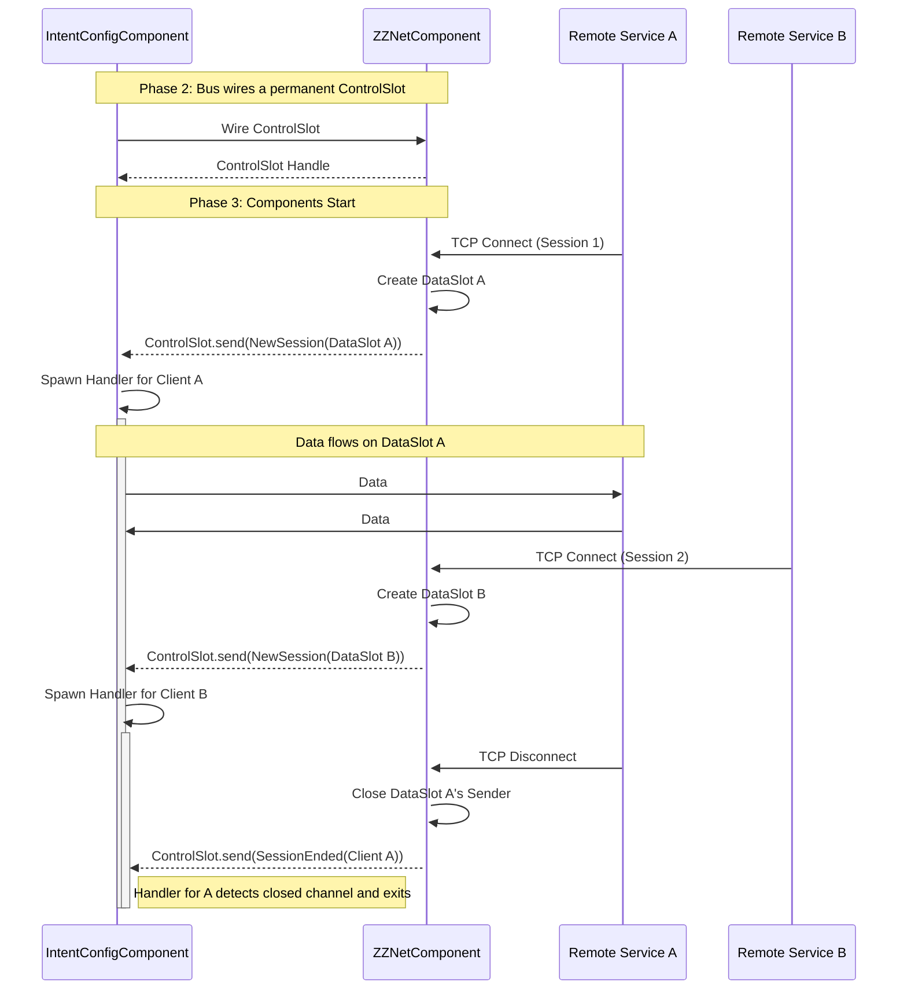
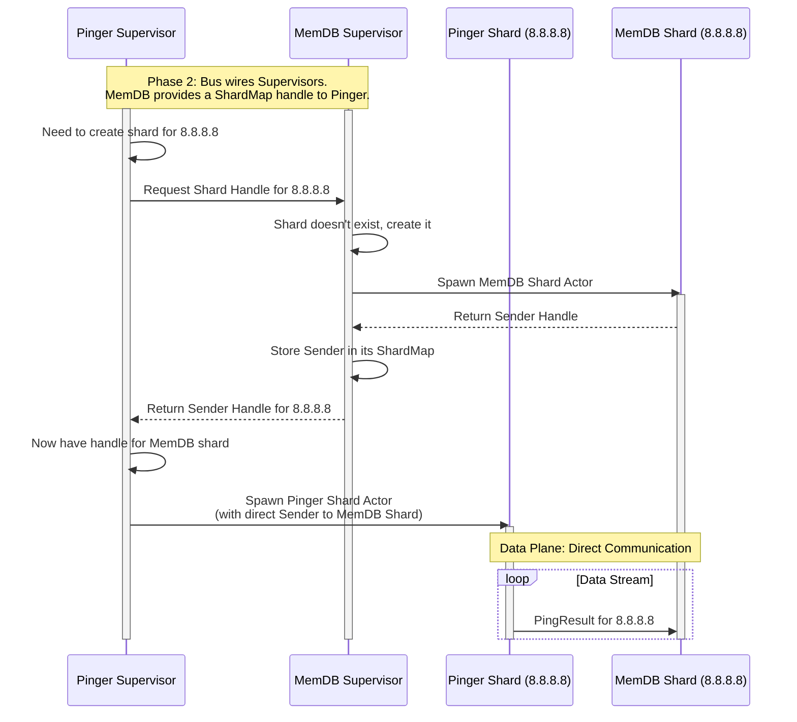

### **Document Title: ZZPing Component Framework: Architectural Design & Rationale**

NOTE: Deprecated documentation.

**Version:** 1.0 **Authors:** David Martínez Martí, AI Design Partner

---

### **Chapter 1: Introduction & Guiding Principles**

#### **1.1. Purpose**

This document defines the official architectural vision for the ZZPing project's component model. Its goal is to
establish a robust, reusable framework for building and composing autonomous, asynchronous **Components** within a
running **Service**. This design supersedes the initial ad-hoc implementations found in the `zznet` and `intent-config`
prototypes and will serve as the blueprint for all future development. This document describes the **target
architecture**, noting that the current codebase is a prototype from which these architectural lessons were learned and
is slated for refactoring to meet this new design.

#### **1.2. The Problem Statement: The "Snowflake" Architecture**

The initial prototypes, while functional and well-tested, exhibited a core architectural weakness. The code was
difficult to reason about, lifecycles were ambiguous, and usage patterns were governed by unwritten, implicit rules.

Each implementation felt like a "snowflake"—a unique, fragile solution that worked in isolation but lacked a cohesive,
underlying philosophy. This made the system hard to maintain and scale, as a developer needed expert knowledge of each
component's internal details to use it correctly. The goal of this new architecture is to replace this collection of
snowflakes with a uniform, predictable, and resilient framework.

#### **1.3. A Precise Lexicon: Core Concepts**

To eliminate ambiguity, this document will adhere to the following precise definitions:

- **Service:** A complete, long-running OS process. A Service is the "Composition Root" that hosts and manages
  Components. Examples: `zzping-collector`, `zzping-database`.
- **Component:** An autonomous, encapsulated, long-running task (an actor) _within_ a Service. Components are the
  framework's primary building blocks. Examples: `MemDBComponent`, `PingerComponent`.
- **Intra-Process Communication:** Communication _between Components_ within a single Service. This occurs exclusively
  via reliable, in-memory Tokio channels (`mpsc`, `watch`, `oneshot`).
- **Inter-Process Communication:** Communication _between Services_. This occurs exclusively through the unreliable
  network, abstracted by the `zznet` boundary component.

#### **1.4. Guiding Principles & Core Requirements (The Constraints)**

The following principles form the non-negotiable foundation of this architecture.

- **Principle of Two Domains:** The framework strictly separates two communication domains. **Intra-process**
  communication is considered reliable. **Inter-process** communication is considered unreliable. The framework's
  primary role is to safely and explicitly bridge these two domains.

- **Compiler-Enforced Safety over Runtime Logic:** The framework must be designed to make incorrect usage a compile-time
  error wherever possible. We must favor static guarantees from the Rust type system over runtime checks that can be
  forgotten or implemented incorrectly.
- **Explicit Lifecycles:** Components must have clear, manageable lifecycles. Their creation, activation, and graceful
  shutdown must be explicit and owned by the Service. "Fire-and-forget" background tasks that become zombies are
  explicitly forbidden.
- **The Principle of a "Session":** For inter-process communication, the network connection _is_ the session. The
  framework must assume that a transport-level failure (e.g., a TCP disconnect) implies that the remote peer's state has
  been reset (e.g., due to a process restart). This failure is a critical lifecycle event that _must_ be propagated to
  the relevant local Components, not hidden by a transparent resiliency layer.

### **Chapter 2: Autopsy of the Prototype: Analysis of the "Snowflakes"**

This chapter dissects the specific problems in the initial codebase. These are the anti-patterns we are explicitly
designing the new framework to eliminate.

#### **2.1. The Implicit Protocol Problem**

The prototype's API was shaped like a collection of independent tools, but it was actually a machine that had to be
assembled in a specific, un-enforced order.

- **Example:** `ZzNet::listen_for_channel` could be called on a client-configured `ZzNet` instance. The code would
  compile, but the returned channel would never receive any messages, leading to silent, difficult-to-debug runtime
  failures.

#### **2.2. The Divorced Lifecycle Problem**

The lifecycle of a Component's core logic was completely disconnected from the lifecycle of its public-facing handle
object.

- **Example:** `IntentConfig::new_server()` would immediately call `tokio::spawn`, launching an actor task. If the user
  dropped the returned handle, the actor task would continue running as a "zombie" process, leaking resources and state.
  There was no mechanism for graceful shutdown.

#### **2.3. The Spooky Action at a Distance Problem**

The prototype broke the purity of the actor model by re-introducing shared mutable state, creating a non-obvious and
fragile data flow.

- **Example:** The `zznet-lib` facade used an `Arc<Mutex<Option<Connection>>>`. A background networking task would
  occasionally write a `Connection` object into this global variable, while a foreground task would try to read from it,
  creating a classic race condition.

#### **2.4. The Ambiguous Identity Problem**

The system lacked a mechanism for establishing a stable, logical identity for remote Services, making stateful
orchestration across reconnections impossible.

- **Example:** The server assigned a simple, incrementing `u64` `ClientId` for each new TCP connection. If a collector
  Service disconnected and reconnected, it would receive a new `ClientId`, and the server-side orchestrator had no way
  of knowing it was the same logical entity.

### **Chapter 3: The Architectural Vision: A Framework for Composable Components**

To solve these foundational issues, we are moving from writing isolated components to building a cohesive **framework
for composing asynchronous Components.**

#### **3.1. The Foundation: Layered Networking Architecture**

This Component framework is built upon a foundational networking library (`zznet`) which is itself composed of three
carefully layered crates:

- **`zznet-api`:** An abstract API layer defining traits like `ZzChannel` that represent networking capabilities without
  implementation details.
- **`zznet`:** A concrete implementation of the networking engine that fulfills the API contracts.
- **`zznet-lib`:** A factory layer that provides convenient construction and configuration of networking components.

This three-layer architecture ensures that Components, by depending only on the `zznet-api` traits, are completely
decoupled from networking implementation details. This decoupling is a major enabler of the Component framework's
flexibility and testability—Components can be tested with mock networking implementations, and the networking layer can
be evolved independently without breaking dependent Components.

#### **3.2. The Paradigm Shift**

A "Component" is a long-running, autonomous sub-program (an actor) with a clearly defined set of responsibilities. The
framework's job is to make it easy to instantiate, configure, connect, and manage the lifecycle of these Components
within a Service.

#### **3.3. The Three-Phase Component Lifecycle (The Core Pattern)**

This is the heart of the new architecture. Every Component in the system will follow this explicit, three-phase
lifecycle, enforced by the type system.

1.  **Phase 1: Instantiation (The Builder):** Components are first created as inert `...ComponentBuilder` objects. These
    builders hold configuration data but contain no active logic.

    ```rust
    // Creates data-only builders, does not spawn any tasks.
    let memdb_builder = MemDBComponent::new(memdb_config);
    let pinger_builder = PingerComponent::new(pinger_config);
    ```

2.  **Phase 2: Wiring (Dependency Injection):** The builders are connected to each other. This is where the
    intra-process communication channels (`mpsc`, `watch`, etc.) are created and shared between Components _before_ any
    of them start running.

    ```rust
    // Connect the builders. This establishes the communication topology.
    pinger_builder.connect_to_memdb(&memdb_builder);
    ```

3.  **Phase 3: Activation (The Handle):** The `.start()` method is called on a fully-wired builder. This method consumes
    the builder, spawns the Component's actor task, and returns a `Running...Handle`. This handle is the Component's
    public API and the tool for managing its lifecycle.
    ```rust
    // Consumes the builders and returns live handles.
    let memdb_handle = memdb_builder.start();
    let pinger_handle = pinger_builder.start();
    ```

##### Diagram: Three-Phase Component Lifecycle

```mermaid
graph TD
    subgraph "Phase 1: Instantiation (Inert Builders)"
        A[Service: let pinger_builder = PingerComponent::new(...)]
        B[Service: let memdb_builder = MemDBComponent::new(...)]
    end

    subgraph "Phase 2: Wiring (Dependency Injection)"
        C(Service: pinger_builder.connect_memdb(&memdb_builder))
    end

    subgraph "Phase 3: Activation (Spawning Actors)"
        D[Service: let pinger_handle = pinger_builder.start()]
        E[Service: let memdb_handle = memdb_builder.start()]
    end

    subgraph "Running System (Handles & Actors)"
        F[pinger_handle]
        G[memdb_handle]
        H((Pinger Actor Task))
        I((MemDB Actor Task))
    end

    A --> C
    B --> C
    C --> D
    C --> E
    D -- owns/manages --> H
    E -- owns/manages --> I
    F -- commands --> H
    H -- data --> I
    G -- commands --> I

    linkStyle 7 stroke:#0f0,stroke-width:2px,stroke-dasharray: 5 5;
    style H fill:#f9f,stroke:#333,stroke-width:2px
    style I fill:#f9f,stroke:#333,stroke-width:2px
```

**Explanation:**

- The flow starts in the Service (the Composer).
- **Phase 1:** Inert `Builder` objects are created.
- **Phase 2:** The `connect_memdb` call wires them together. This is where the communication channel would be created
  and shared.
- **Phase 3:** The `.start()` methods are called, which consume the builders.
- **Running System:** This results in `Handle` objects that the Service owns. These handles are used to command the
  background Actor Tasks, which are now running independently. The green dashed line shows the data flow over the
  channel that was established during the wiring phase.

#### **3.3.1. Eliminating a Class of Race Conditions by Design**

The three-phase lifecycle pattern is not merely a convenience; it is a critical reliability feature that eliminates an
entire class of race conditions that plague distributed systems. This pattern solves the notorious "late subscriber" or
"cold start" race condition that has caused countless hours of debugging in production systems.

**The Problem:** In traditional pub/sub architectures, publishers may start sending messages before all subscribers are
ready, leading to lost initial messages or inconsistent state. This is particularly insidious in systems where the first
message carries essential initialization data—a service might appear to be running correctly but be operating with
incomplete or stale state due to missed startup messages.

**The Solution:** The `wire-then-start` model makes this race condition impossible by design. During the wiring phase,
all communication channels are established and subscribers are guaranteed to be listening _before_ any publisher can
send its initial message in the activation phase. This compile-time enforcement ensures that all Components begin with a
consistent, synchronized state.

**The Significance:** This pattern moves the responsibility for correct initialization from the developer's runtime
logic to the compiler's static checks, which represents a massive leap in system robustness. Rather than relying on
careful coordination code that can be forgotten or implemented incorrectly, the framework makes incorrect startup
ordering a compile-time impossibility. Entire frameworks have been built around solving this single problem; we
eliminate it at the architectural level.

#### **3.4. The `ServiceCommsBus` Concept**

As a potential quality-of-life improvement, the manual `connect_to_*` wiring could be centralized into a
`ServiceCommsBus`. Components would register their required and provided communication slots, and the bus would handle
the wiring automatically. This is a future refinement to consider for scalability.

### **Chapter 4: Core Framework Design: Agreed-Upon Solutions**

This chapter details the specific, agreed-upon solutions to the most critical architectural challenges.

#### **4.1. The `zznet` Boundary Component & "Session Provisioning"**

**Design Rationale:** The core challenge at the heart of any networked system is bridging two fundamentally different
worlds: the static, reliable intra-process Component environment and the dynamic, unreliable inter-process network
environment. Traditional approaches often try to hide this impedance mismatch, but our architecture makes it explicit
and manageable.

- **The Problem:** How to bridge the static, reliable intra-process world with the dynamic, unreliable inter-process
  world, while respecting the "Transport Failure == Session Failure" principle.
- **The Solution: The "Queue of Queues" Model.** The `zznet` Component will act as a **Session Provisioner**.
  - The connection between a local Component (e.g., `IntentConfigComponent`) and the `ZZNetComponent` is a permanent,
    statically-wired **`ControlSlot`**.
  - Messages over this `ControlSlot` are lifecycle events, primarily `NewSession(SessionHandle)`.
  - The `SessionHandle` contains a dedicated, ephemeral **`DataSlot`** (a channel pair for `Vec<u8>`), which represents
    the data plane for a single, unique remote session.
- **How This Solves Connection Awareness:** The lifecycle of the `DataSlot` is tied 1:1 to the lifecycle of the
  underlying `zznet` connection. When a disconnect occurs, `zznet` closes its end of the `DataSlot`. Any local Component
  task using that slot will immediately receive `None` on its next read, providing a clean, unambiguous, and
  compiler-enforced signal that the remote session is dead.

##### Diagram: Session Provisioning Model



**Explanation:**

- The `ControlSlot` is the permanent communication line established at startup.
- When `Service A` connects, `ZZNetComponent` creates a new set of channels (`DataSlot A`) and sends the handle for it
  down the `ControlSlot`.
- `IntentConfigComponent` receives this and spawns an internal handler for that specific session.
- The same process repeats for `Service B`.
- When `Service A` disconnects, `ZZNetComponent` closes its side of `DataSlot A`. The dedicated handler in
  `IntentConfigComponent` sees the channel close and terminates, cleaning up that session's resources without affecting
  the handler for `Service B`.

#### **4.2. Rejected Alternative: The "Transparent Resilient Channel"**

**Design Rationale:** During the architectural design phase, we carefully considered whether the `zznet` Component
should attempt to hide network disconnects from local Components by automatically reconnecting and buffering messages.
This approach is common in many distributed systems and initially appeared attractive as a way to simplify client code.

**The Core Domain Insight:** We explicitly rejected this model based on a fundamental insight about our specific
operating environment: **In this system, 99.9% of TCP disconnects are not random network flaps; they are the result of a
process restart, and therefore a state reset. Optimizing for the 0.1% case at the expense of creating ambiguity in the
99.9% case is an unacceptable architectural trade-off.**

**Reason for Rejection:** This model violates our core "Session Principle." In our domain, a TCP disconnect is a strong
signal of a peer process restart and state reset. Hiding this critical lifecycle event would lead to state
desynchronization and data corruption.

In our domain, when a collector process restarts, it loses all its accumulated ping statistics, timing windows, and
other ephemeral state. If the database service continued to operate under the assumption that the collector's state was
intact (because the disconnect was hidden by a transparent resiliency layer), it would make orchestration decisions
based on false information, potentially leading to data loss or corruption.

**The Alternative:** The chosen "Session Provisioning" model, while more complex, is architecturally correct for our use
case. It ensures that session state boundaries are explicit and that state resets are immediately visible to all
dependent Components.

#### **4.3. Service Identity**

- **The Problem:** The need for a stable, logical identity for remote Services to enable stateful orchestration (like
  handoffs) across multiple connections.
- **The Solution:** A client's identity will be a tuple: `(StableId, ConnectionNonce)`.
  - The **`StableId`** is a `String` representing the persistent, logical entity, cryptographically derived from the
    Subject Common Name (CN) of the client's mTLS certificate (e.g., `"collector-de-lon-01"`).
  - The **`ConnectionNonce`** is an ephemeral `u64` for a single TCP connection, generated randomly by the client and
    sent in its initial `Hello` message. This provides the orchestrator with the necessary context to distinguish
    between different processes of the same logical Service.

#### **4.4. Solving the 'Hung Process' Handoff Failure via Duality of Authority**

**The Problem:** Zero-downtime handoffs in distributed systems face a particularly nasty failure mode that is often
overlooked: the hung or zombie process. Standard orchestration assumes that a non-responsive process is a dead process.
This assumption is dangerously false in real-world operating conditions where a process can hang (due to CPU starvation,
memory pressure, or deadlocks) without cleanly exiting. This leads to a critical race condition.

Consider this scenario:

- A collector process (C1) hangs without cleanly exiting. The operating system, seeing the process is still alive, does
  not release its exclusive `TCPlock`.
- The remote Database service, observing missed heartbeats, correctly assumes C1 is faulty and commands a new collector
  (C2) to become `Primary`.
- C2 attempts to acquire the local `TCPlock` as part of its promotion, but fails because the zombie C1 process still
  holds it.
- The system is now in a **split-brain state**: the Database _thinks_ C2 is primary, but C2 _knows_ it isn't and cannot
  perform its duties.

This creates a dangerous inconsistency where orchestration decisions are made based on false assumptions about which
process is actually active, leading to a silent and prolonged data outage.

**The Solution: Duality of Authority with Explicit Confirmation.** To solve this, the framework mandates that a handoff
requires agreement from two independent authorities before a state transition is considered complete: 1. The **Database
Scheduler** (the remote, _strategic_ authority) decides _when_ and _which_ collector should become primary based on its
view of the global system state. 2. The **`TCPlock`** (the local, _tactical_ authority) on the collector host enforces
that only one process can physically hold the primary role at a time, preventing local split-brain scenarios.

**The Mechanism:** A collector cannot become `Primary` solely because the database scheduler commanded it; it must
_also_ successfully acquire the local `TCPlock`. The protocol is as follows:

1. The Database sends a `PromoteToPrimary` command.
2. The receiving collector attempts to acquire the `TCPlock`.
3. If it fails, the collector enters a new, explicit state: **`AwaitingLock`**.
4. In this state, the collector continues to heartbeat, but reports its `current_role` as `AwaitingLock`.

This explicit state turns the ambiguous failure into a piece of observable system telemetry. The Database scheduler can
now distinguish between a healthy `Primary` and a `Primary`-elect that is blocked. This allows the system's control
plane (and any human operators) to understand the exact nature of the problem—that a handoff is contested by a zombie
process—and take precise corrective action, such as forcefully terminating the hung process. This protocol of explicit
confirmation ensures that both authorities are synchronized, eliminating the race condition while maintaining resilience
against partial failures.

### **Chapter 5: Open Design Questions & Candidate Patterns (Work In Progress)**

This chapter explores the next layer of design challenges. The core framework is considered solid; the following are
candidate patterns for implementing more complex interactions on top of it. **The proposals herein are not yet finalized
and require further discussion and prototyping.**

#### **5.1. The "View into the Component" API**

- **The Problem:** How to safely and performantly query state from a running Component actor, especially from a
  synchronous context like a GUI, without breaking encapsulation or causing UI freezes.
- **Rejected Approach: `Arc<RwLock<T>>`:** Rejected due to high risk of UI freezes from lock contention and its
  violation of the actor's exclusive state ownership.
- **Candidate Pattern: The Push-based "View Model":**
  1.  The GUI sends a command to the `MemDBComponent` handle to subscribe to a view, specifying the desired data
      (`ViewSpec`).
  2.  The `MemDBComponent` actor spawns an internal task to periodically re-run this query against its private data,
      producing a `ViewModel`.
  3.  This `ViewModel` is published on a `tokio::sync::watch` channel.
  4.  The GUI holds the `watch::Receiver` and performs cheap, non-blocking checks for new `ViewModel`s in its
      synchronous update loop.

##### Diagram: Push-based View Model Pattern

```mermaid
sequenceDiagram
    participant GUI as GUI
    participant MDB as MemDBComponent Handle
    participant Actor as MemDB Actor
    participant Task as View Task

    Note over GUI,MDB: GUI initiates subscription

    GUI ->> MDB: handle.subscribe_view(ViewSpec)
    MDB ->> MDB: Create watch channel (watch_tx, watch_rx)
    MDB ->> Actor: Command::SubscribeView(ViewSpec, watch_tx)
    MDB -->> GUI: return watch_rx

    Note over Actor: Actor receives command and spawns task
    activate Actor
    Actor ->> Actor: Clone Arc<Data> (read-only)
    Actor ->> Task: Spawn View Task(ViewSpec, Arc<Data>, watch_tx)
    activate Task

    loop Periodic View Updates
        Note over Task: Task reads data directly via Arc<Data>
        Task ->> Task: Query/Filter data via Arc<Data>
        Task ->> Task: Generate ViewModel
        Task ->> Actor: watch_tx.send(ViewModel)
    end

    loop UI Update Loop
        Note over GUI: Non-blocking check for new data
        GUI ->> GUI: if watch_rx.has_changed() then borrow latest ViewModel
        GUI ->> GUI: Redraw UI
    end

    deactivate Task
    deactivate Actor
```

**Explanation:**

- The GUI calls `handle.subscribe_view(ViewSpec)` to request a view of the data.
- The handle creates a `watch` channel pair (`watch_tx`, `watch_rx`) synchronously and returns the `watch_rx` to the GUI
  immediately.
- The handle sends a command to the actor with the `ViewSpec` and `watch_tx`.
- The actor receives the command, clones its internal data as a read-only `Arc<Data>`, and spawns a dedicated
  `View Task` with the `ViewSpec`, `Arc<Data>`, and `watch_tx`.
- The `View Task` periodically queries the data via the `Arc<Data>`, generates a `ViewModel`, and pushes it to the
  `watch_tx`.
- The GUI performs cheap, non-blocking checks on the `watch_rx` in its update loop and redraws when a new `ViewModel` is
  available.
- This pattern bridges the async actor world with the synchronous GUI world without locks or blocking operations, while
  keeping the actor as a supervisor and avoiding bottlenecks.

#### **5.2. The Component Sharding Problem**

- **The Problem:** How to manage Components that are internally sharded (e.g., by `IpAddr`) without creating a central
  supervisor bottleneck for all data traffic.
- **Candidate Pattern: The "Shard Supervisor":**
  1.  A sharded Component (e.g., `MemDBComponent`) exposes a handle to a thread-safe map of its shards (`ShardMap`).
  2.  During wiring, another Component (e.g., `PingerComponent`) receives this `ShardMap` handle.
  3.  When the `PingerComponent` needs to create a shard for a new target, it uses the handle to discover or request the
      corresponding shard in the `MemDBComponent`.
  4.  It receives a sender that communicates **directly** with the `MemDB` shard actor, bypassing the supervisors for
      all high-frequency data plane traffic.

##### Diagram: Shard Supervisor Pattern



**Explanation:**

- The Supervisors (`PSup`, `MSup`) are the long-lived actors.
- When `PSup` needs to ping a new target, it first coordinates with `MSup` on the **control plane** to ensure the
  corresponding `MemDB` shard exists.
- `MSup` acts as a factory, creating the `MemDB` shard if needed and returning its direct channel `Sender`.
- `PSup` then creates its own `Pinger` shard, injecting the `Sender` it just received.
- From that point on, all high-frequency **data plane** traffic flows directly from `PShard` to `MShard`, completely
  bypassing the supervisors.

#### **5.3. The Serialization Problem**

- **The Problem:** How to bridge the strongly-typed Intra-Process world with the untyped (`Vec<u8>`) Inter-Process world
  of `zznet`. This involves three sub-problems: Routing/Discovery, Boilerplate/Ceremony, and Error Handling.
- **Candidate Pattern: Framework-Managed Serialization:** The `ServiceCommsBus` or wiring logic could be enhanced to
  handle serialization implicitly. A Component would declare a remote-bridged slot with a specific type `T` where
  `T: Serialize`. The framework would be responsible for injecting the (de)serialization logic and routing the byte
  stream from the correct named `zznet` channel, thus keeping the Component logic clean and type-safe. The exact error
  handling policy for malformed data remains an open design question.

### **Appendix A: Glossary of Terms**

- **Service:** A complete, long-running OS process that acts as the "Composition Root" hosting and managing Components.
  Examples: `zzping-collector`, `zzping-database`.
- **Component:** An autonomous, encapsulated, long-running task (an actor) _within_ a Service. Components are the
  framework's primary building blocks. Examples: `MemDBComponent`, `PingerComponent`.
- **ComponentBuilder:** An inert, data-only struct used to configure a Component before it is started.
- **RunningComponentHandle:** The public-facing API and lifecycle manager for a started Component. Returned by the
  builder's `.start()` method.
- **Composer:** The top-level application code (e.g., in `main.rs`) responsible for executing the three-phase lifecycle:
  Instantiation, Wiring, and Activation.
- **ServiceCommsBus:** A (potential) central object to manage the wiring of Components.
- **ControlSlot:** A permanent, statically-wired channel between a local Component and the `zznet` Component, used for
  exchanging session lifecycle events.
- **DataSlot:** An ephemeral channel pair provisioned by `zznet` over the `ControlSlot`, representing the data plane for
  a single remote session.
- **Session Provisioning:** The architectural pattern where the `zznet` Component uses the `ControlSlot` to provide
  `DataSlot`s to other Components.
- **Intra-Process Communication:** Communication _between Components_ within a single Service. This occurs exclusively
  via reliable, in-memory Tokio channels (`mpsc`, `watch`, `oneshot`).
- **Inter-Process Communication:** Communication _between Services_. This occurs exclusively through the unreliable
  network, abstracted by the `zznet` boundary Component.

### **Appendix B: Architectural Philosophy & Rationale**

ZZNet and this Component Framework are aimed at a way to create a distributed app over LAN, where different processes
communicate via ZZNet, and the process is divided into components such that they can be fully unit tested and easy to
reason about, to contain the responsibilities. Think of a super-app that has parts that can fail and be restarted - or
have different lifetimes; or have processes doing the same type of work but in different machines, then joining the
work.

ZZNet uses a custom TCP protocol and not gRPC, because gRPC is overkill for this, but it could be made pluggable or
enable backends via features in a future if someone else is interested enough on that. With this said, the communication
is very specific to maintain the state of this super-app across processes - it is not a general mechanism to serve data.
We do not expect a third party connecting to this. gRPC or HTTP servers could co-exist on top, to provide other
capabilities or expose some stuff to third parties. Even if ZZNet used gRPC, the proto definitions and the protocol
would likely be specific to this, and be of little use to other applications that are not following the model. A
developer wanting gRPC or HTTP integration likely wants just to add a gRPC / HTTP on top, as a separate connection
mechanism with custom API.

This document outlines a main bus `ServiceCommsBus` - this is not a real actor. It does not have a lifetime. This is
just a dressing on top to automate the setup of the components in an automated way - it ceases to exist once the
components are wired. The developer is free to connect them manually in any custom way.

Usually components would create their custom types for outputs of this framework that are specific to them. It feels
weird that an input of type T could be provided by two different components in a production system. However, it is
expected to have a component with compatible outputs with a given input - a mock component, used for testing. But one
does not mix and match mock components with prod components outside of unit testing.

This framework, in case it is not clear enough, is to create a super-set of an application made of components, that
spans multiple processes that can live on different computers of the same LAN. Or potentially across the internet - with
some limitations. But it is, in fact, a framework for building a single, cohesive, distributed application (a
"super-app") that is composed of multiple collaborating processes (Services). The framework solves the problem of
composing the internals of each Service, while zznet solves the problem of communication between them.

Some would argue that Static Composition forbids a dynamic creation - this is not entirely true. In this framework one
would need to create the components from the beginning, but these could be sharded with initially zero contents - making
it empty. And dynamically the developer can increase or decrease the number of shards, even if it is for just moving
from 0 to 1.

But wouldn't it be better if we could even add them dynamically at runtime and connect them? No. The core of this
approach is to make complex designs and architectures very easy to reason about, to only need a bit of context when
reading a component and not needing to understand what other components do. To understand the whole system by looking on
how components are they wired. Add dynamic insertion and removal, and all this is gone. On top of that, it creates all
sorts of problems such as late addition or unexpected removal of connections - this makes reasoning about how a
component behaves much complex. The guarantee that the inputs and outputs are permanently plugged for the whole duration
of the component lifetime makes it much easier to understand.

A single component panicking takes down the whole process: Yes, and that is the point. This is similar to Mutex
poisoning. It is a very hard task to recover from something like that, once a component panics, the app no longer knows
in which status is. Recovering from it, trying to restart a component, would enter us into the dynamic addition and
removal of components, and we already defined how bad it is. Instead, if a part of a program is deemed to be risky and
crash-like, these components should be moved to their own process/service and communicate via zznet. That way, the
processes are isolated, and the communication via zznet does indeed expect dynamic addition or removal of peers.

### **Appendix C: Implementation Status & Future Work (As of Sept 16, 2025)**

This appendix provides a snapshot of the project's progress in implementing the architectural vision outlined in this
document. It serves to track what has been accomplished, what remains, and to provide a more detailed exploration of the
open design questions from Chapter 5.

#### **C.1. The Journey: From "Snowflakes" to a Framework Kernel**

The architectural vision presented in this document was born from an analysis of a prototype implementation. To validate
this new vision, a **Phase 1 MVP** was executed with the goal of refactoring the original `zznet-lib` and
`intent-config` components to a new, shared set of architectural patterns.

This initial phase was a resounding success. The work produced a new crate, **`ZzChorale`**, which now contains the
kernel of our component framework. The refactored components proved that the **Three-Phase Lifecycle
(`Builder -> Wire -> Start -> Handle`)** is a viable and robust foundation.

The primary outcome of this MVP is a significant de-risking of the project. The most fundamental and difficult
architectural questions have been answered not just in theory, but with working, tested code. We have successfully moved
from a collection of "snowflake" components to the beginning of a uniform, predictable framework.

#### **C.2. Implementation Status Summary**

The following table summarizes the current status of each major architectural concept against the design laid out in
this document.

| Feature / Concept                                  | Status             | Notes                                                                                                                              |
| :------------------------------------------------- | :----------------- | :--------------------------------------------------------------------------------------------------------------------------------- |
| **Core Framework (`ZzChorale`)**                   |                    |                                                                                                                                    |
| **`Builder -> Wire -> Start -> Handle` Lifecycle** | ✅ **Implemented** | The core pattern is now a reusable crate with the `create_actor` helper, `Actor` trait, and generic `ComponentHandle`.             |
| **`zznet` Component**                              |                    |                                                                                                                                    |
| **"Session Provisioning" Pattern**                 | ✅ **Implemented** | The `ZzNetComponent` actor correctly acts as a session provisioner, providing `DataSlot`s to consumers.                            |
| **Stable Service Identity (`StableId`, `Nonce`)**  | ❌ **Pending**     | `zznet` still uses an ephemeral `u64` `ClientId`. Implementing identity from mTLS certs is a critical next step.                   |
| **`zzping-collector` Service Logic**               |                    |                                                                                                                                    |
| **Handoff Protocol (`AwaitingLock`)**              | ❌ **Pending**     | Requires Stable Service Identity to be implemented first. The framework now provides the necessary primitives to build this logic. |
| **Framework Ergonomics & Features**                |                    |                                                                                                                                    |
| **`ServiceCommsBus` (Auto-wiring)**                | ❌ **Conceptual**  | Correctly deferred. The MVP uses manual dependency injection.                                                                      |
| **"View into the Component" API Pattern**          | ❌ **Conceptual**  | The `ComponentHandle` is the prerequisite, but the "Push-based View Model" pattern is not yet implemented.                         |
| **"Shard Supervisor" Pattern**                     | ❌ **Conceptual**  | No generic tooling for sharding exists yet in `ZzChorale`.                                                                         |
| **Framework-Managed Serialization**                | ❌ **Conceptual**  | Components currently handle their own `serde` logic for network communication.                                                     |

#### **C.3. Deep Dive: The Road Ahead (Remaining Design & Implementation)**

The MVP has provided the foundational layer. The next phase of work will involve building upon this foundation by
tackling the open design questions from Chapter 5 and implementing the remaining core features from Chapter 4.

##### **C.3.1. Critical Next Step: Stable Service Identity**

The highest-priority task is the implementation of **Stable Service Identity** as defined in Section 4.3. Without this,
no meaningful cross-Service orchestration (like the `zzping-collector` handoff) is possible.

- **Required Work:**
  1.  Modify the `zznet` `ConnectionActor`'s handshake protocol. After the TLS handshake is complete, it must inspect
      the peer's certificate to extract the Subject Common Name (CN) as the `StableId`.
  2.  The initial `Hello` message from a client must be updated to include a randomly generated `ConnectionNonce`
      (`u64`).
  3.  The `ClientId` type, currently a `u64`, must be changed throughout the `zznet` component to be the
      `(StableId, ConnectionNonce)` tuple.
  4.  The `listen_for_channel` method's signature will change to provide this new, richer `ClientId` to the consuming
      component.

##### **C.3.2. Open Question: The "Shard Supervisor" Pattern**

The current framework requires sharded components to implement all their own multiplexing and shard-management logic. To
make the framework more powerful, we must design and implement generic tooling for the "Shard Supervisor" pattern.

- **Problem:** Avoid a central supervisor bottleneck for high-frequency data by enabling direct shard-to-shard
  communication.
- **Proposed Solution Sketch:**
  1.  **Introduce a `ShardMap<K, V>` handle:** This would likely be a type alias for `Arc<DashMap<K, mpsc::Sender<V>>>`.
      It's a clonable, thread-safe directory of running shards.
  2.  **Refine the Wiring Phase:** Instead of passing a simple `mpsc::Sender`, the `ServiceCommsBus` (or manual wiring)
      would pass a `ShardMap` handle from a "provider" component (like `MemDBComponent`) to a "consumer" component (like
      `PingerComponent`).
  3.  **Define a Control Protocol:** The supervisors would need a way to communicate. The `PingerComponent` supervisor
      would send a message to the `MemDBComponent` supervisor like `EnsureShardExists(shard_key)`. The `MemDBComponent`
      supervisor would then create the shard if needed and ensure its `Sender` is published in the shared `ShardMap`.
- **Challenges:** This introduces the need for a request/response mechanism between component supervisors on the control
  plane, which must be designed carefully.

##### **C.3.3. Open Question: The "View into the Component" API**

This is critical for building UIs or any external system that needs to read a Component's state.

- **Problem:** Provide a safe, non-blocking, and performant way for an external, synchronous context (like `eframe`) to
  query the state of an internal, asynchronous actor.
- **Proposed Solution Sketch:**
  1.  **Formalize the "View Model" pattern:** The `ZzChorale` framework could provide a generic `ViewProvider` struct
      that encapsulates the logic.
  2.  A component author would give the `ViewProvider` a `Arc`-wrapped reference to its state and a query function
      `(State, ViewSpec) -> ViewModel`.
  3.  The `ViewProvider` would manage the internal task that re-runs the query and publishes to the `watch` channel.
  4.  The `ComponentHandle` would expose a `subscribe_view(&self, spec: ViewSpec) -> watch::Receiver<ViewModel>` method.
- **Challenges:** Requires careful design of the generic types (`ViewSpec`, `ViewModel`) and the communication between
  the component's main actor and its view-generating sub-task.

##### **C.3.4. Open Question: The `ServiceCommsBus`**

- **Problem:** Manual wiring of components is explicit but becomes tedious and error-prone as the number of components
  in a Service grows.
- **Proposed Solution Sketch:**
  1.  **Trait-based Discovery:** Components would declare their dependencies and provisions via traits. For example:
      `impl Provides<MemDBChannel>` and `impl Requires<MemDBChannel>`.
  2.  **The Bus as a Typed Registry:** The `ServiceCommsBus` would have methods like
      `register<T: Provides<...>>(&self, provider: T)` and `wire_all(&self)`.
  3.  During the `wire_all` call, the bus would iterate through all registered components, match the `Requires` traits
      to the `Provides` traits, create the necessary channels, and perform the dependency injection.
- **Challenges:** This requires a sophisticated design using Rust's trait and type systems. It's a significant piece of
  work but would be the final step in creating a truly ergonomic and safe component framework.
